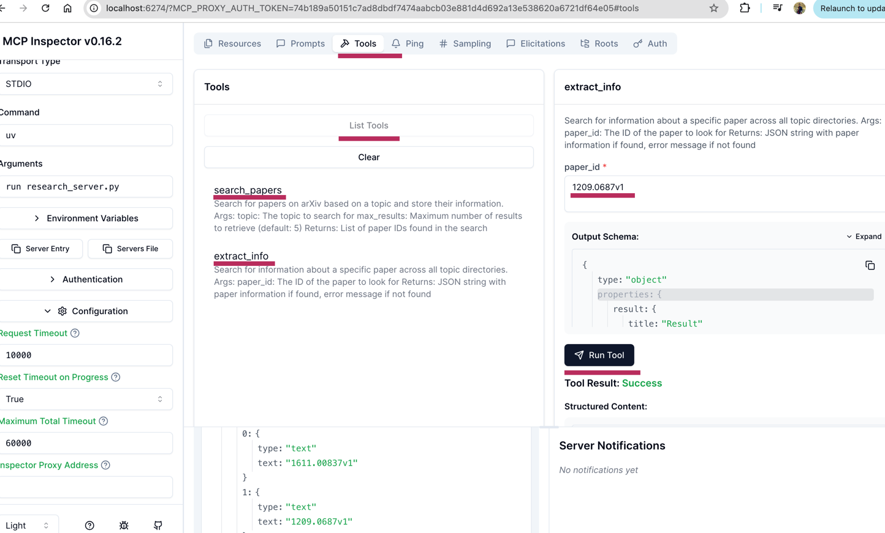

# arxiv_toolkit

Tutorial : https://learn.deeplearning.ai/courses/mcp-build-rich-context-ai-apps-with-anthropic/lesson/fkbhh/introduction

A simple Python project to search and extract research papers from arXiv using `arxiv` API.

## Usage

pip install -r requirements.txt

```
python main.py
```

For chat bot input

```commandline

{"tool": "search_papers", "args": {"topic": "AI", "max_results": 3}}

{"tool": "extract_info", "args": {"paper_id": "2101.00001"}}

```




