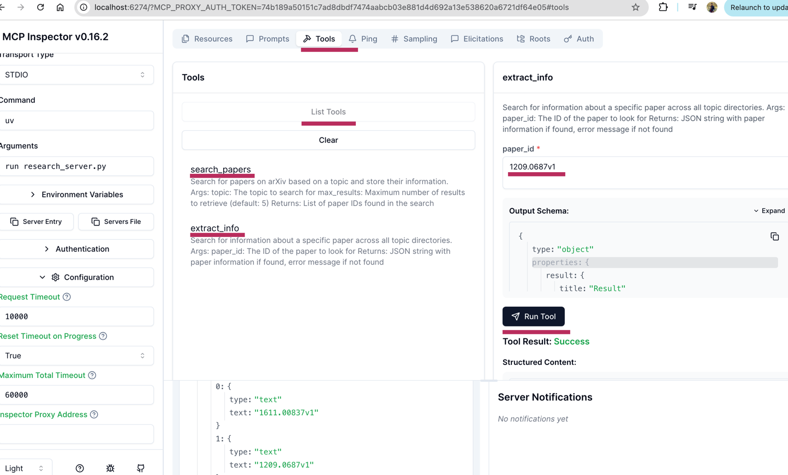

## To RUN
In the research_server.py folder we have already defined the mcp tools

* This project has two sections MCP_Server and MCP_client -> MCP_Client is inside MCP_Client directory.


TO start the server

Use UV package manager to install certain dependencies

```
uv init
source .venv/bin/activate
uv add mcp arxiv
(to disable auth)
 DANGEROUSLY_OMIT_AUTH=true npx @modelcontextprotocol/inspector uv run research_server.py

npx @modelcontextprotocol/inspector uv run research_server.py
```
* 

To run client

* uv add anthropic python-dotenv nest_asyncio
* uv run mcp_client/mcp_chatbot.py 


